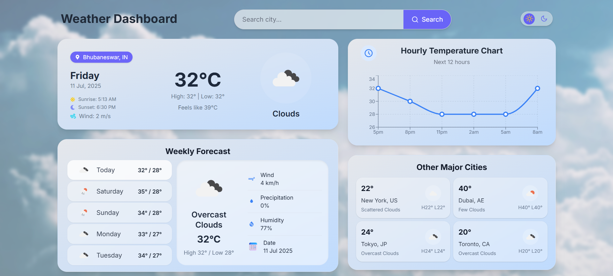
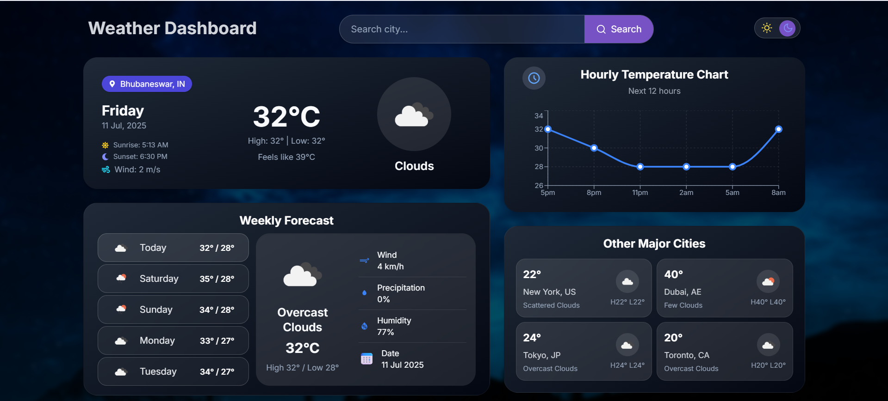

# 🌤️ Weatherly — Modern Weather Web App

A sleek, responsive weather application that delivers real-time weather updates, 5-day forecasts, hourly trends, and weather stats for popular cities. Built with **React + Vite**, **TailwindCSS**, and animated for a smooth user experience.

---

## 🚀 Live Demo

🌐 [Check it out on Vercel]()

---

## ⚙️ Features

- 🌡️ **Current weather** with icon, temperature, location, sunrise/sunset
- 📈 **Hourly temperature chart** with tooltip and precipitation/wind info
- 📆 **5-day forecast** with clickable cards that reveal animated details for each day
- 🌍 **Other major cities** section showing key weather stats
- 🔍 **Smart search** with city suggestions using OpenWeather Geo API
- 🌓 **Dark & Light Mode** toggle with smooth transition
- 💅 Built with **Tailwind CSS**, **React Icons**, and **Recharts**

---

## 🛠️ Tech Stack

- ⚛️ React + Vite
- 🎨 Tailwind CSS
- 📊 Recharts for temperature chart
- 📦 OpenWeatherMap API (Current, Forecast, Geo)
- 🌍 Responsive and mobile-first design
- 🎭 Animations using Tailwind keyframes

---

## 📸 Screenshots

| Light Mode | Dark Mode |
|------------|-----------|
|  |  |

> 📂 Place your screenshots in a `screenshots/` folder at root for easy access.

---

## 🧠 How to Use

1. **Search** for any city to get current weather + forecast
2. **Toggle theme** to experience different UI modes
3. Scroll down for **charts** and other cities' weather data

---

## 🧪 Local Setup

```bash
# 1. Clone this repo
git clone https://github.com/your-username/weatherly.git
cd weatherly

# 2. Install dependencies
npm install

# 3. Add your API key
# Create a .env file and add:
VITE_WEATHER_API_KEY=your_openweathermap_api_key

# 4. Start dev server
npm run dev
